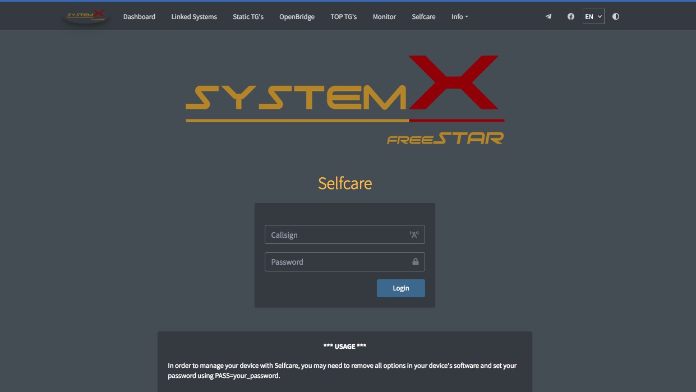

**Dashboard backend with Selfcare for SystemX Servers**

***This version has been forked from FDMR Monitor with Selfcare by CS8ABG. Thanks for all contrib***

---

**FDMR Monitor by OA4DOA**

FDMR Monitor for FreeDMR Servera based on HBMonv2 https://github.com/yuvelq/FDMR-Monitor 

---

**HBMonv2 by SP2ONG**

HBMonitor v2 for DMR Server based on HBlink/FreeDMR https://github.com/sp2ong/HBMonv2 

---

**hbmonitor3 by KC1AWV**

Python 3 implementation of N0MJS HBmonitor for HBlink https://github.com/kc1awv/hbmonitor3 

---

## Motorola IPSC repeaters

RYSEN reports IPSC systems (`MODE: IPSC`, `PROTOCOL: IPSC`) on the TCP report socket (default port 4321). These appear on **Linked Systems** in the Repeaters section with callsign, DMR ID, Motorola software/hardware, and live TS1/TS2 activity. Point `[FDMR CONNECTION]` in `fdmr-mon.cfg` at your RYSEN instance (use the container IP on Docker Compose, not `127.0.0.1`).

IPSC repeater selfcare (static TS1/TS2) is implemented on the `ipsc` branch; MMDVM hotspot selfcare is unchanged. See [doc/ipsc-selfcare-roadmap.md](doc/ipsc-selfcare-roadmap.md).

**Admin (IPSC):** install once with `sudo ./scripts/install-selfcare-admin.sh`, then run `sudo selfcare-admin` (symlink in `/usr/local/sbin`; bash + docker + php-cli for hashes — no Python on host).

---

Copyright (C) 2013-2018  Cortney T. Buffington, N0MJS <n0mjs@me.com>

This program is free software; you can redistribute it and/or modify it under the terms of the GNU General Public License as published by the Free Software Foundation; either version 3 of 
the License, or (at your option) any later version.

This program is distributed in the hope that it will be useful, but WITHOUT ANY WARRANTY; without even the implied warranty of MERCHANTABILITY or FITNESS FOR A PARTICULAR PURPOSE. See the 
GNU General Public License for more details.

You should have received a copy of the GNU General Public License along with this program; if not, write to the Free Software Foundation, Inc., 51 Franklin Street, Fifth Floor, Boston, MA 
02110-1301  USA

---
